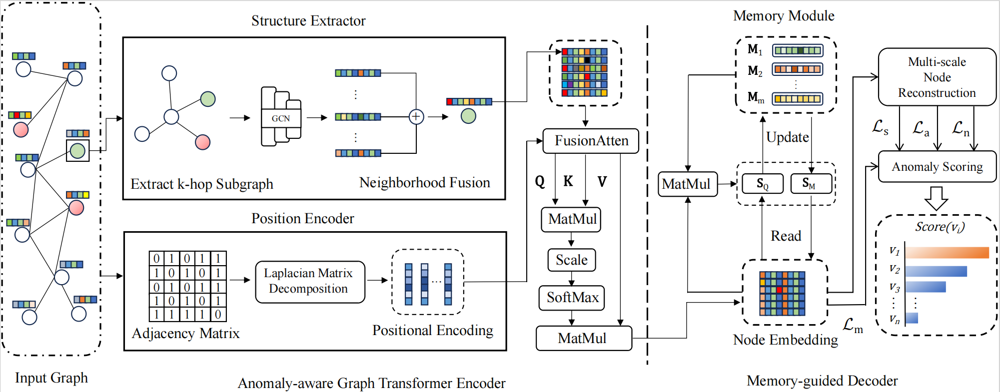

# Memory-guided Graph Transformer for Node-level Anomaly Detection

## Abstract

Node-level anomaly detection (NLAD) focuses on identifying nodes that significantly deviate from the majority within a graph. Many NLAD methods rely on graph convolutional networks (GCNs) to derive node representations and have achieved considerable success. However, GCNs have several well-known issues, such as over-smoothing and over-squashing, which limit their performance in NLAD. Meanwhile, many graph reconstruction-based NLAD methods are inevitably disrupted by anomalous nodes during reconstruction. This allows models designed to reconstruct normal nodes, can also achieve good reconstruction of anomalies, ultimately degrading their performance. To tackle the above problems, in this work, we improve the graph Transformer as encoder, enhancing its ability to perceive node structure differences while overcoming the over-smoothing problem. Additionally, we incorporate the memory mechanism to record normal node patterns, guiding the model to better reconstruct normal nodes and reduce the influence of anomalous nodes. Experimental results show that our proposed method effectively mitigates the model's misidentification of anomalous nodes and achieves state-of-the-art performance across seven benchmark datasets from various domains.



## Usage

Firstly,  you need to install the required packages.

```python
pip install -r requirements.txt
```

You can choose which dataset to use, and run the command.

```
python main.py --dataset ${dataset}
```

